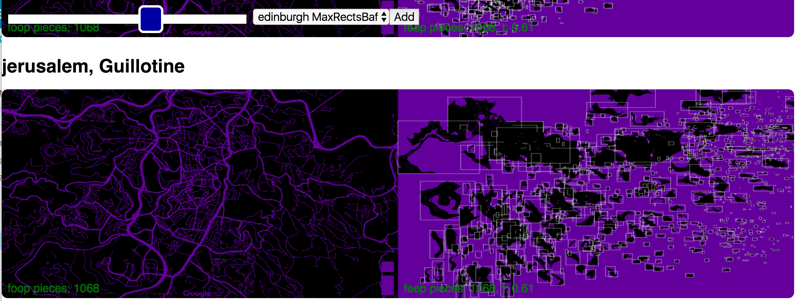
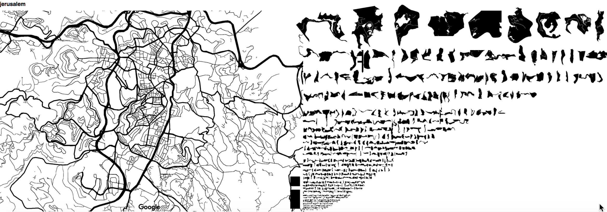

# Biscuits

This is a side project for playing with automatically destructuring
cities in a similarish way to that done by the artist Armelle Caron,
see http://www.armellecaron.fr/works/les-villes-rangees/.

## August 2019: Garibaldi

Where I got to with Speculaas was great to get an idea with what can be done with automatic layouts based
on bin packing algorithms, where the whole area is treated as one "bin". However, it was lacking in a
few major aspects.

The bin-packing algorithms are quite slow to execute, as they are np-hard in general. This is not a new
learning, but given that my execution language was Python the impact of the algorithmic hardness was
increased by having a slow execution language. Also, the layouts from bin-packing algorithms don't look
anywhere near as nice as the original artists work.

Speculaas is based on hand-picked screenshots of maps. This was a deliberate compromise but
limits discovery and comparison; it's hard to add new areas and hard to be sure they are being compared at
same size scale.

When it comes to implementation I did this as Python running on Kubernetes. The Kubernetes part was fine in
general but brings with it a bunch of overheads. Add onto this the cpu requirements of running python and it
quickly eats into my personal Kubernetes budget.

So the aims for the next iteration (Garibaldi) are:

- free choice of areas at a fixed set of zoom levels i.e. any area on the world can be chosen that corresponds
  to zoom levels which show city details
- allow automatic layouts that don't correspond only to bin-packing algorithms
- fast dynamic updates i.e. where possible, data is produced quickly in response to user interactions and
  not as a batch offline process

Also, I have a bunch of technologies I am interested in exploring, so I'll be chosen from those.

This leads to a few interesting implementation constraints:

- Bias towards processing vectors which preserve structures, as opposed to using images
- Bias towards languages which:
  - can be made fast, for general responsiveness and reducing the impact of np-hard algorithms
  - have a low memory footprint, so that they don't take up space in browser or in back-end clusters
  - can be made to run either in-browser or on back-end, so that computation can move to where it is needed
  - have a mature grpc implementation that allows services written in different languages to interoperate

Also, some allowances:

- This doesn't need to run in all browsers i.e. so backwards incompatibility is allowed

### Approach

1. Choose aspect ratio of area, and real height e.g. 16:9 and height of 1km.
2. Chunk this to a bounding box represented by a pair of geohashes at some fixed geohash accuracy, where top-left corner of top-left geohash and top-left corner of bottom-right geohash define the area.
3. Choose mapbox as the map provider.
4. This allows us to define a binary image, where we start with a white image and then draw in black all features we want to act as separators between areas. This would be features like roads, sea, etc. We get these by getting a set of vector or raster tiles which represent these features and then drawing them to an image, where we truncate and offset the points in the features. This means we end up with a binary image which corresponds to the original bounding box.
5. Take this binary image and find connected components. This defines our "biscuits" as separate raster images.
6. Convert these raster images back to vectors by taking each separately as a binary image and tracing around the edge.
7. Ask the layout algorithm to take these inputs and lay them out by arranging into an area which retains tha original aspect ratio but can be bigger or smaller.
8. These biscuits can then be animated back onto the main grid in the front-end, displayed using a canvas overlay over the main mapbox map.

#### WIP Approach

- (/) Initial display:

  - (/) display list of pre-chosen places
  - (/) allow select of a place

- (/) Show Map of place at (lat, lon)

  - (/) Show navigation which allows going back to main list

- ...

## April 2018 : Speculaas

I've re-used the city images and the connected components from the previous work. This then allowed me to:

1. [pieces-finder](speculaas/pieces-finder): For each set of connected components, process
   them using the [rectpack](https://github.com/secnot/rectpack) bin-packing library in two ways: 1. find a compact sprite packing of the connected components to reduce download size for any
   visualisations; the previous packing was very simple but large 2. find all variations of the bin-packings available and make them available as alternative layouts
2. [pieces-view](speculaas/pieces-view): provide visualisations of a selected subset of layouts which can
   be animated and displayed at reasonable speed on both mobile and desktop: http://speculaas.houseofmoran.io/
3. make above layouts available at a [GraphQL endpoint](http://speculaas.houseofmoran.io/graphql) so that
   others could build on this if they wanted to.

I also used this an opportunity to:

- learn how to deploy and use a kubernetes cluster
- learn a practical application of GraphQL

## September 2017

The overall strategy is:

1. Manually construct an image of a city via a Grab of a Black and White
   map, from somewhere like [Snazzy Maps](https://snazzymaps.com/style/8007/black-and-white-without-labels),
   such there is a clear figure/ground delineation.
2. Use OpenCV to extract and and dump:

- basic labelled metadata (dimensions / positions) of connected components
- connected components as separate images, rendered as a transparent png
  with area in black

3. Use React + Canvas rendering + d3 animations to:

- sort and pack areas by size
- animate the chunks into place over original image
